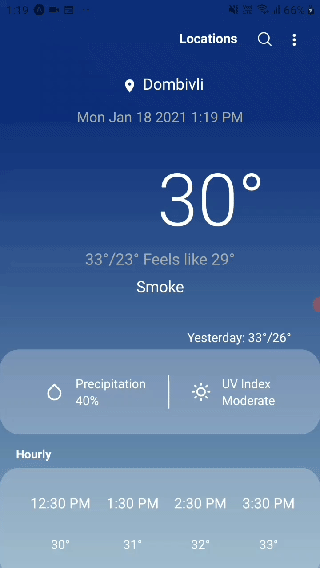
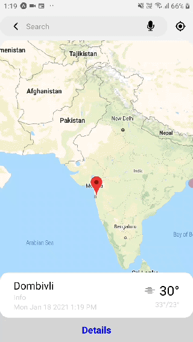
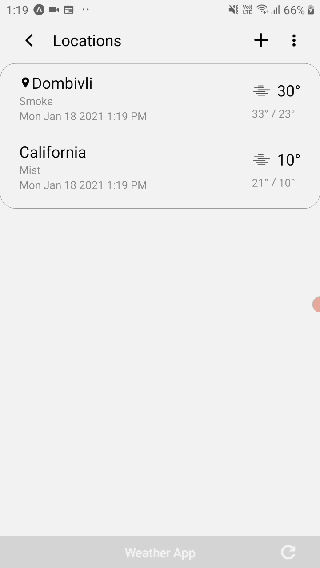
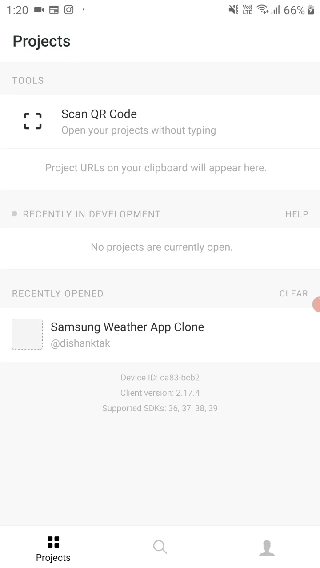
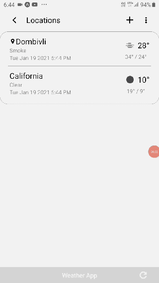

# Weather-App
This a Weather Application, UI was inspired from Samsung’s Weather App, that updates user with weather of their current location, that is retrieved using an OpenWeather API and also allows user to add cities to track their weather. App is built using ReactNative with all the feature components of Lists, Refreshing, Loading, Map, Error Alerts and Conditional Icons

# Demo

App Loading and getting Weather for Current Location loading

Searching for City and Adding to Persistent List

Updating Weathers of Existing City in Location Screen

List are persistent even on reopening the app

Deleting a City from the List. User Cannot delete currently located city from list.
